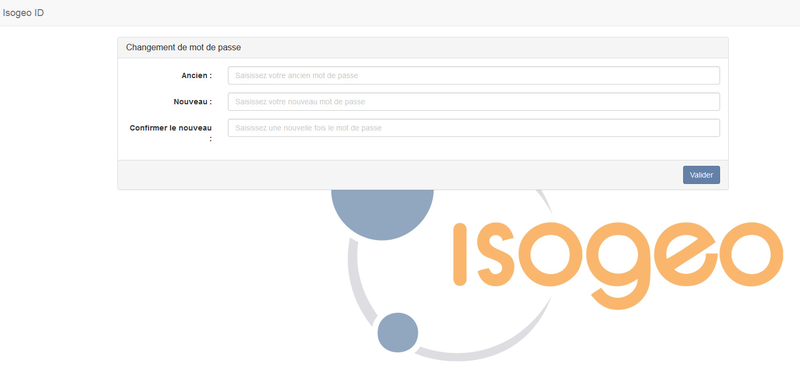

# Gérer mon  mot de passe

Pour [modifier votre mot de passe](https://id.isogeo.com/change-password) :

1.	Cliquer sur votre nom en haut à droite de l’écran ;
2.	Cliquer  sur le menu « Paramètres » pour accéder aux paramètres de votre compte utilisateur
3.	Cliquer sur le lien « Modifiez ou réinitialisez votre mot de passe ;
4.	Indiquer votre ancien et votre nouveau mot de passe.

