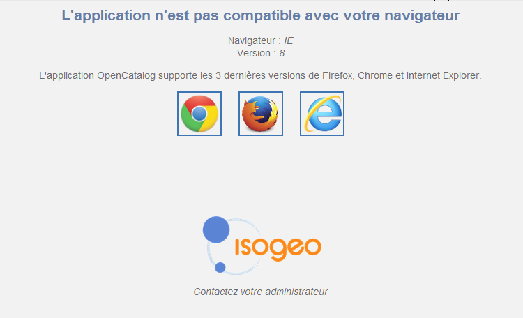

Isogeo est une application web qui vous permet de gérer et partager un catalogue exhaustif, à jour et documenté de vos données géographiques.

Ce document vous explique pas à pas, comment l’utiliser.

# Prérequis techniques

Pour accéder à Isogeo vous pouvez utiliser l'un des navigateurs suivants :

Navigateurs supportés :

* Internet Explorer 10 et +
* Firefox ESR
* 3 derniéres versions stables de Firefox et Chrome

Pour accéder à Open Catalog vous pouvez utiliser l'un des navigateurs suivants :

Navigateurs supportés :

* Internet Explorer 9 et +
* Firefox ESR
* 3 derniéres versions stables de Firefox et Chrome

Navigateurs compatibles :

