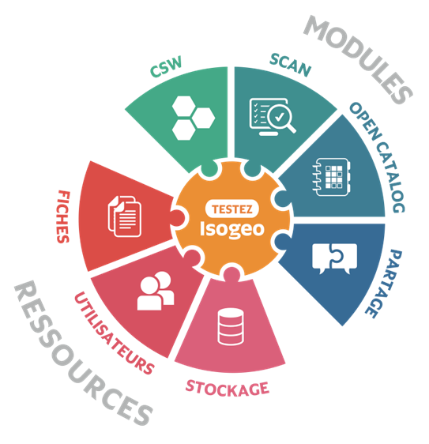

Isogeo est une application web qui vous permet de gérer et partager un catalogue exhaustif, à jour et documenté de vos données géographiques.

Ce document vous explique pas à pas, comment l’utiliser.

