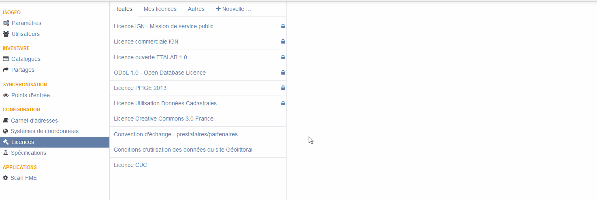

# Gérer les licences

Les conditions d'accès et d'utilisation d'une donnée constituent une information aussi essentielle que délicate à renseigner. Pour s'en convaincre, on peut renvoyer vers le [chapitre dédié des recommandations nationales](http://georezo.net/wiki/main/donnees/inspire/aide_a_la_saisie_des_metadonnees_inspire#contraintes_en_matiere_d_acces_et_d_utilisation).

Pour porter à connaissance de vos utilisateurs cette précieuse information et faciliter énormément le travail de documentation, Isogeo vous permet de gérer un référentiel de licences dans lequel vous pouvez par exemple ajouter vos conventions d'échanges de données.

Plus besoin de réviser chacune de vos fiches. Du temps de gagné, des métadonnées de qualité !

> Astuce : accéder directement aux [licences](https://app.isogeo.com/admin/licenses).

## Les différentes licences

Par défaut, Isogeo propose un certain nombre de licences de référence. Elles sont identifiables facilement grâce à l'icône de cadenas en regard du titre dans la liste.

Grâce aux onglets, vous pouvez filtrer :
* [`Mes licences`](https://app.isogeo.com/admin/licenses/owned) : seulement les licences de votre groupe de travail ;
* [`Autres`](https://app.isogeo.com/admin/licenses/shared) : les licences disponibles par défaut par Isogeo ;
* `Toutes` : l'ensemble des licences.

## Ajouter une licence

Pour ajouter une licence au sein de votre groupe de travail, il vous suffit de :

1.	Dans le menu `Administration` > `Licences` ;
2.	Cliquer sur le bouton [`+ Ajouter`](https://app.isogeo.com/admin/licenses/new) ;
3.	Renseigner :
    * le nom : intitulé descriptif comportant généralement le numéro de version ou la date de référence ;
    * l’URL : le lien vers le document complet de la licence ;
    * et un résumé des conditions (libre ou pas, payant ou pas, restreint ou pas, etc.).
4.	Cliquer sur `Créer`, `Enregistrer` ou `Supprimer`.

Toutes les licences ajoutées sont disponibles dans l’onglet `CGU` > `Conditions` lors de l'édition d'une fiche de métadonnées.



## Usage avancé

Tenant compte du fait que les textes des licences sont rarement lus, une bonne pratique consiste à mettre des pictogrames résumant les principales conditions.

Par exemple, pour indiquer une licence de type libre, impliquant la citation de la source mais empêchant la réutilisation commerciale ou la modification, on peut avoir recours à la [syntaxe markdown](/fr/features/documentation/syntax_markdown.html) :

### Syntaxe

```no-highlight


```

### Rendu


