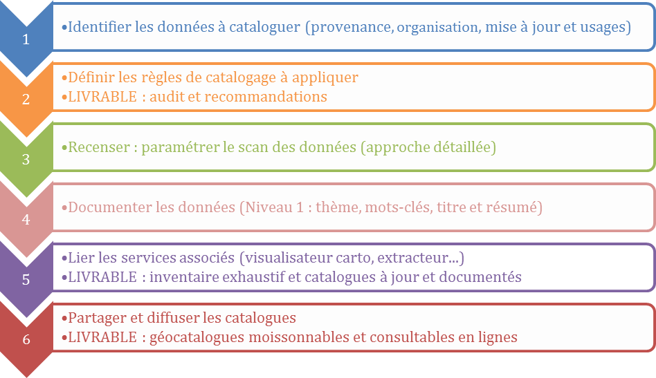
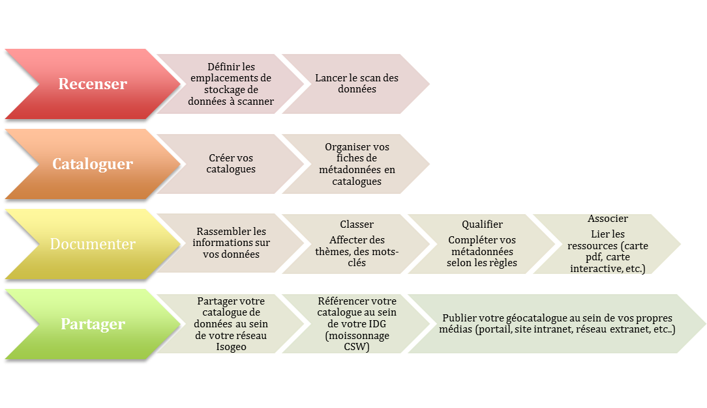
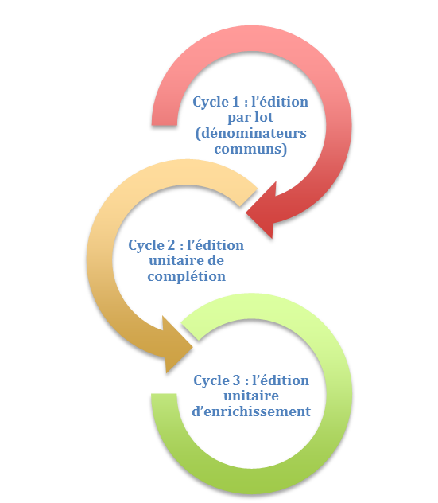

# Eléments méthodologiques pour renseigner les métadonnées

Pour créer et partager un catalogue exhaustif et documenté de vos données SIG, c’est très simple. Il vous suffit de suivre le processus suivant :

## Processus global d’un projet de catalogage

Ce processus de travail doit être compris avec une dimension itérative. L’objectif est d’aborder la gestion du patrimoine de données de façon progressive : commencer par boucler le processus sur un échantillon de données puis capitaliser dessus pour adapter les règles de catalogage en rebouclant sur le processus.

Petit à petit, vous gagnerez en automatisme et le temps imparti au catalogage sera réduit au maximum.

## Méthodologie de catalogage avec Isogeo

## Les cycles d'une documentation efficace

Plus concrètement, voici comment nous vous conseillons de procéder pour avancer facilement dans le catalogage :

1.	Sélectionner les données ayant le plus de dénominateurs communs et éditer par lot (tout ce qui est générique)

2.	Ouvrir chacune des fiches dans un onglet différent et compléter avec les informations essentielles spécifiques (titre, contacts…)

3.	Sur chacune des fiches apporter des informations spécifiques (attributs, ressources associées…)

## Ressources à disposition

### Les guides de saisie

Le groupe de travail sur les métadonnées, composé de membres du Groupe de liaison et du Groupe de Travail GéoSource du CNIG, animé par M. Léobet et dont le secrétariat a été assuré par E. Roos, a créé des guides de recommandations nationales concernant les métadonnées INSPIRE des séries et ensembles de séries de données. Ils sont destinés à ceux qui doivent saisir les métadonnées, et permettent de répondre aux obligations imposées par la règlementation.

* [Guide de saisie pour les données - Version complète - v1.1.1 de juillet 2014](http://cnig.gouv.fr/wp-content/uploads/2014/07/Guide-de-saisie-des-%C3%A9l%C3%A9ments-de-m%C3%A9tadonn%C3%A9es-INSPIRE-v1.1.1.pdf) (pdf de 705 Ko)
* [Guide de saisie pour les données - Version allégée - v1.1 de décembre 2013](http://cnig.gouv.fr/wp-content/uploads/2014/01/Guide-de-saisie-des-%C3%A9l%C3%A9ments-de-m%C3%A9tadonn%C3%A9es-INSPIRE-v1.1-final-light.pdf) (pdf de 396 Ko)
* [Guide de gestion des catalogues de métadonnées INSPIRE - version 1.0 - août 2012](http://inspire.ign.fr/sites/all/files/2012-08-20_guide-catalogues-md-inspire-v1.0.pdf) (pdf de 249 Ko)
* [Guide de saisie sur le Wiki de GeoRezo](http://georezo.net/wiki/main/donnees/inspire/aide_a_la_saisie_des_metadonnees_inspire) (html)

En tant que membre actif de ce groupe de travail, Isogeo vous accompagne dans ce travail de saisie.

### Exemples de métadonnées

Pour que vous puissiez avoir des modèles de fiches complètes, nous avons documenté les données du référentiel administratif GeoFLA :

* les [départements de France métropolitaine en 2014](http://open.isogeo.com/s/344d51c3edfb435daf9d98d948fa207e/Sbd1w7PgqE8n7LDq3azRqNhiMHZf0/m/754209f115c040a48d43ffc262b16500) ;
* les [communes de France métropolitaine en 2014](http://open.isogeo.com/s/344d51c3edfb435daf9d98d948fa207e/Sbd1w7PgqE8n7LDq3azRqNhiMHZf0/m/fa079cbb63cd4099bf249e572dbf4563).

