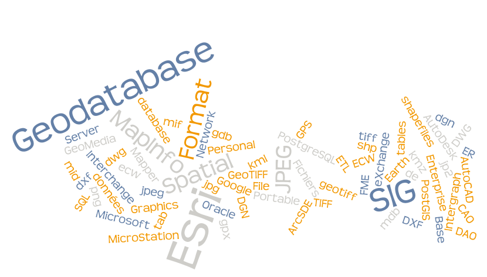

# Les formats de données pris en charge automatiquement

Le service est théoriquement capable de scanner l’ensemble des formats pris en compte par l’ETL  FME sur lequel il est basé. Cependant, nous ajoutons les nouveaux formats au fur et à mesure des besoins rencontrés.

## Les formats de fichiers

* Esri shapefiles (.shp),
* Esri Personal Geodatabase (.mdb),
* Esri File Geodatabase (.gdb),
* MapInfo tables (.tab),
* MapInfo Interchange Format (.mif / .mid),
* Intergraph GeoMedia database (.mdb),
* AutoCAD DWG (.dwg),
* AutoDesk DXF (.dxf),
* MicroStation DGN (.dgn),
* Google Earth - seule la 1ère couche est prise en compte (.kml / .kmz) ;
* GPS eXchange Format (.gpx),
* ER Mapper ECW (.ecw),
* GeoTIFF (.geotiff),
* JPEG (.jpg / .jpeg)
* JPEG 2000 (.jp2),
* Portable Network Graphics (.png),
* TIFF (.tiff),

## Les formats de bases de données

* Esri Enterprise Geodatabase (ArcSDE),
* Microsoft SQL Server Spatial (toutes versions) ;
* Oracle Spatial (toutes versions),
* PostGIS (toutes versions),

Tous les formats ne sont néanmoins pas pris en compte au même degré et de la même façon, compte-tenu de leurs spécificités. Le tableau 1 rappelle également que certaines licences sont nécessaires à la prise en charge de certains formats.

## Licences minimales requises

| Stockage | Type    | Format                       | Dépendances indispensables | Licence FME  |
|:-------- | ------- | ---------------------------- | -------------------------- | ------------ |
| Fichiers | Vecteur | MapInfo TAB                  | .tab, .dat, id, . map      | Professional |
| Fichiers | Vecteur | Esri shapefile               | .shp, .dbf, .shx           | Professional |
| Fichiers | Vecteur | MapInfo Interchange Format   | .mif, .mid                 | Professional |
| Fichiers | Raster  | Enhanced Compression Wavelet | .ecw                       | Professional |
| Fichiers | Raster  | GeoTIFF                      | .tiff / .tif / .geotiff    | Professional |
| Fichiers | Raster  | JPEG 2000                    | .jp2 / .jpk                | Professional |
| Fichiers | CAO/DAO | AutoCAD DWG                  | .dwg, .prj                 | Professional |
| Fichiers | CAO/DAO | Autodesk Exchange Format     | .dxf, .prj                 | Professional |
| Fichiers | CAO/DAO | Microstation DGN             | .dgn                       | Professional |

