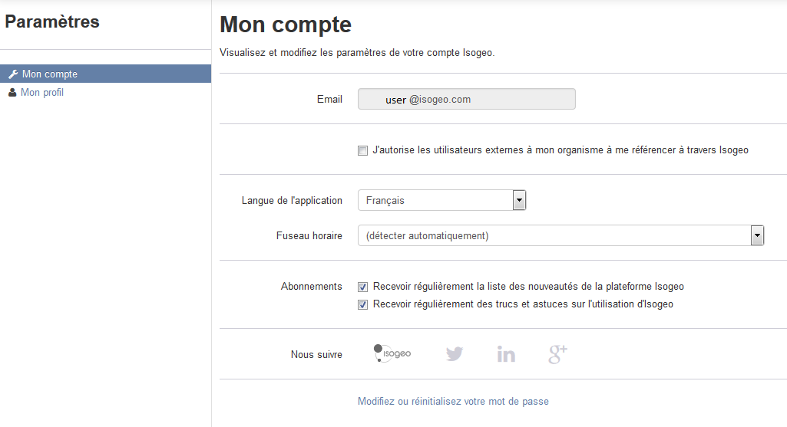

# Paraméter mon compte Isogeo

En cliquant sur votre nom en haut à droite de votre écran, vous pouvez visualiser et modifier les différents paramètres de votre compte Isogeo. Par défaut vous arrivez sur la page de vos réglages.

*Astuce : Vous pouvez aussi y accéder directement via : https://app.isogeo.com/settings/account*

## Être référencé comme contact

En tant qu'utilisateur Isogeo, vous allez certainement être affecté comme contact sur les fiches de métadonnées. Pour éviter de devoir dupliquer [vos coordonnées](user_coordinates.html) dans le carnet d'adresses de votre groupe de travail et de permettre à chacun des éditeurs de la plateforme de vous lier à vos données il vous suffit de :

1.	Cliquer sur votre nom en haut à droite de votre écran ;
2.	Cliquer sur le menu `Paramètres` ;
3.	Cocher `J'autorise les utilisateurs externes à mon organisme à me référencer à travers Isogeo` ;

## Langue et fuseau horaire

Pour l'instant, Isogeo est disponible en 2 langues :
* Anglais ;
* Français.

Vous pouvez spécifier un choix différent pour les paramètres détectés automatiquement :

* La langue est celle du navigateur ;
* Le fuseau horaire est celui du système d’exploitation.

## Abonnements et liens utiles

Vous pouvez choisir de vous abonner ou désabonner à nos listes de diffusion dédiées à nos utilisateurs :

* La liste des nouveautés pour être prévenu des nouvelles versions ;
* La liste des trucs et astuces pour bénéficier de petits tutoriels sur des fonctionnalités ;

Vous pouvez également accéder à nos réseaux sociaux ou bien au blog, sur lequel vous pouvez gérer votre abonnement à la liste de diffusion globale d’Isogeo (indépendant des deux autres).
