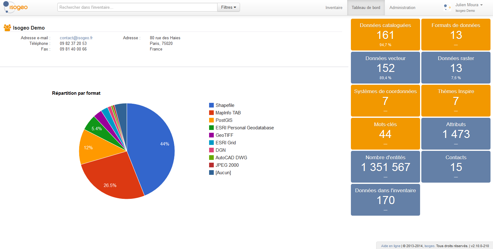
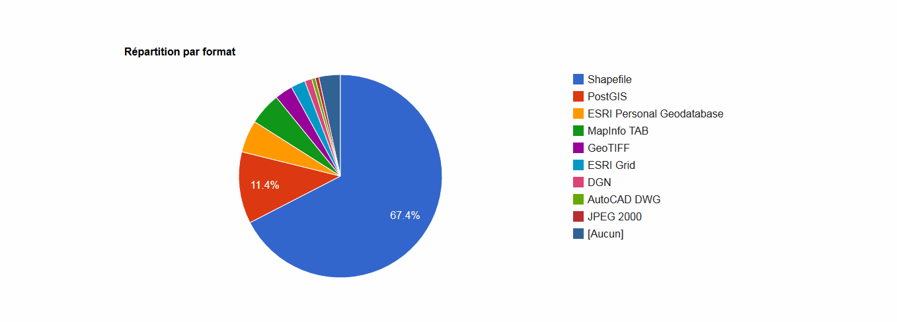
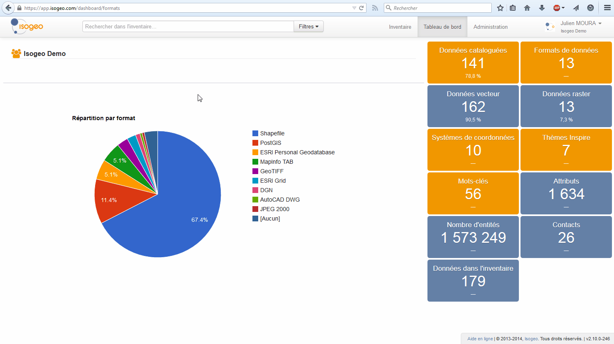

# Le tableau de bord

## Un outil de monitoring

Page d'accueil des administrateurs, il synthètise votre patrimoine de données sous forme de graphiques dynamiques et de métriques interactives :

* nombre total de données inventoriées,
* part des données dans des catalogues et répartition par catalogues,
* répartition par types de données (vecteur ou raster),
* répartition par formats,
* répartition par systèmes de projection,
* répartition par mots-clés,
* répartition par thématiques INSPIRE,
* nombre total d'attributs répertoriés,
* nombre total d'objets géométriques,
* nombre total de contacts.

Chaque catégorie en orange affiche un graphique différent correspondant à la métrique choisie :

Les éléments des graphiques agissent comme des raccourcis filtrés sur l'inventaire. Par exemple, dans le diagramme en camembert des formats, si vous cliquez sur l'un des formats représentés, vous accèderez directement à la liste des données correspondantes au format choisi.

> A noter : les métriques prennent en compte uniquement les données **appartenant** à votre groupe de travail. Celles qui vous ont été partagées par d'autres groupes ou celles moissonnées depuis un service CSW ne sont pas représentées.

## Le point de contact du groupe de travail

contacts dans Isogeo

pré-requis INSPIRE

commun à toutes les MD quand elles sont sous forme de XML (donc dans le CSW)

