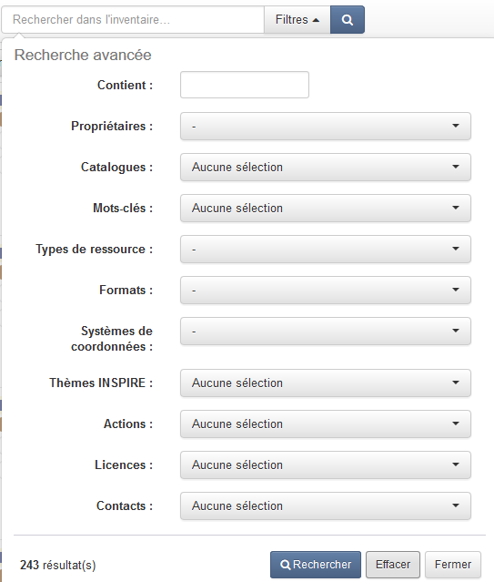
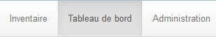
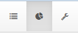
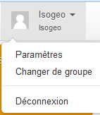

# L'interface globale

Une barre fixe de menus et raccourcis se trouver en haut de l'interface qui est **commune à tous les écrans de la plateforme** Isogeo. Voici le détail des différents éléments qui la composent.

## Le logo Isogeo

Il vous permet de revenir à la [page d'accueil](README.html) à tout moment.

## L'icône de chargement

Entre le logo et la barre de recherche, une roue s'anime à chaque fois que la plateforme travaille vous indiquant qu'il vous faut patienter.

*Astuce : Quand la roue tourne, il ne faut plus cliquer ! Si elle tourne à l'infini, rechargez la page. (proverbe Isogeo)*

## La recherche et les filtres

Où que vous soyez sur Isogeo, vous pouvez lancer une recherche simple ou avancée directement !

> Pour maîtriser au mieux la recherche et la navigation de l'inventaire, voir [le chapitre dédié (5.4)](../features/inventory/README.html).

## Les menus

Les fonctionnalités d’Isogeo sont réparties en 3 menus :

* Le menu [`Inventaire`](inventory.html) permet d'accéder à vos métadonnées et aux fonctions d'édition ;
* Le menu [`Tableau de bord`](dashboard.html) donne aux administrateurs un aperçu global de votre inventaire ;
* Le menu [`Administration`](administration.html) permet aux administrateurs d'ajuster les réglages applicables à tout le groupe de travail.

Si vous utilisez Isogeo à partir d'écrans à basse résolution, il est à noter que les étiquttes disparaissent au profit d'icônes.

## Vos options

A tout moment vous pouvez accéder aux paramètres de votre compte Isogeo.

> Voir les chapitres [2.3](../start/group_switch.html), [2.4](../start/account.html) et [2.5](../start/user_coordinates.html).

## Crédits et numéro de version

En bas de l'interface, vous retrouvez les crédits de la plateforme ainsi que le numéro de version.
