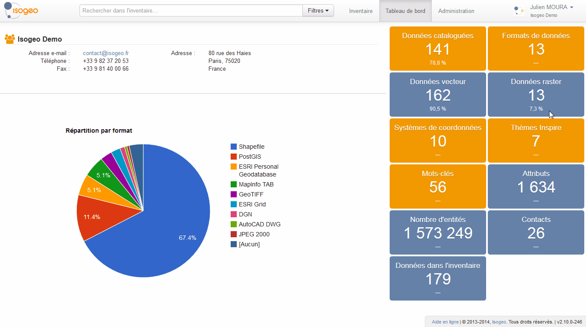

# Groupes

Votre compte Isogeo peut être lié à plusieurs groupes de travail. Le cas échéant, si vous souhaitez changer de groupe, inutile de vous déconnecter, il vous suffit de :

1.	Cliquer sur votre nom en haut à droite de la page ;
2.	Cliquer sur « Changer de groupe », une pop-up s’ouvre ;
3.	Sélectionner le groupe que vous souhaitez rejoindre.

