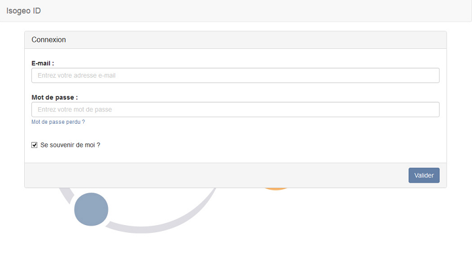

# Se connecter à Isogeo

Pour utiliser Isogeo, il suffit de se rendre sur https://app.isogeo.com muni(e) de vos identifiants de connexion :

* Adresse e-mail : exemple@domaine.fr ;
* Mot de passe : monmotdepasse

Cliquez sur `Valider`.
Isogeo vérifie vos identifiants et vous redirige vers la plateforme.

L’option `Se souvenir de moi ?` est activée par défaut. Elle vous permet d’être automatiquement identifié(e) lorsque vous vous connecterez à Isogeo lors de vos prochaines sessions. Vous pouvez bien sûr désactiver cette option.
