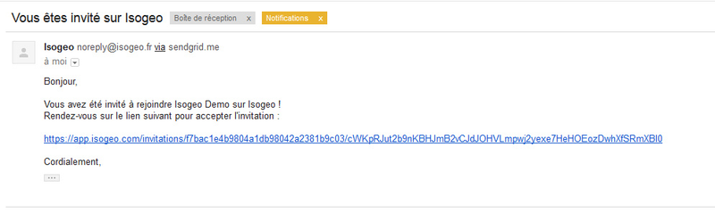
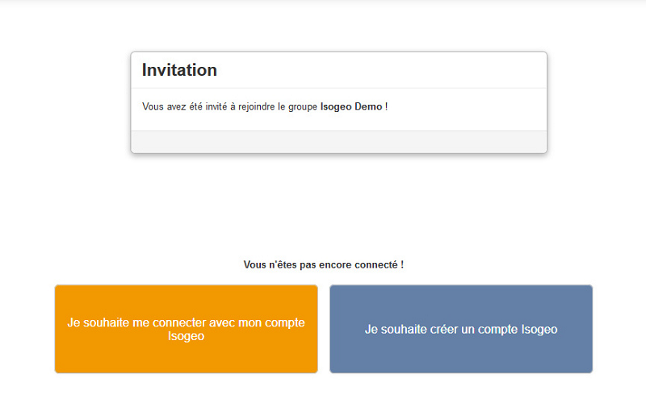

# S'inscrire à Isogeo

Isogeo est une application web professionnelle. Chaque utilisateur y accède via un identifiant et un mot de passe sécurisé qu’il définit lors de son inscription.

Pour s’inscrire à Isogeo il faut y être invité par un administrateur. En effet, dès lors qu’un administrateur a accès à la plateforme il peut inviter autant d’utilisateurs qu’il le souhaite à rejoindre son groupe d’utilisateurs.

Voici les étapes qui suivent l'invitation d'un utilisateur :

1.	Vous venez de recevoir un mail vous invitant à rejoindre un groupe d’utilisateur sur Isogeo :

    

2.	Cliquer sur le lien contenu dans le mail, la page ci-dessous s’ouvre dans votre navigateur :

    

3.	Cliquez sur le lien « Créer un compte ! » la page suivante s’affiche :

    

4.	Indiquer votre Prénom et Nom ;

5.	Indiquer votre mail ;

6.	Créer votre mot de passe ;

7.	Cliquer sur `Valider`, la page suivante s’affiche ;

8.	Cliquer sur `Accepter` vous êtes inscrit à Isogeo !

    

